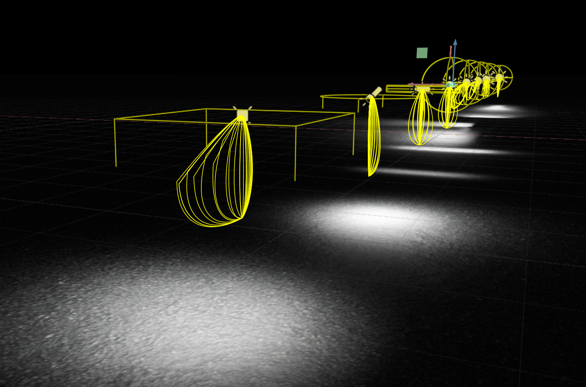

# IES Viewer Omniverse Extension

This extension displays IES profile web for selected light objects. It is particularly useful for visualizing architectural lighting designs. Orientation of measured light distribution profiles could be quickly tested with visual feedback. IES files are resampled to be light weight to render.
This entension is developed based on the [omni.example.ui_scene.object_info](https://github.com/NVIDIA-Omniverse/kit-extension-sample-ui-scene/tree/main/exts/omni.example.ui_scene.object_info)

Supported light type: sphere light, rectangular light, disk light and cylinder light.
Only Type C IES file is supported currently, which is also the most commonly used for architectural light.

## Adding This Extension

To add a this extension to your Omniverse app:
1. Go to Extension Manager and turn on Viewport Utility extension
2. Turn on IESView Extension
